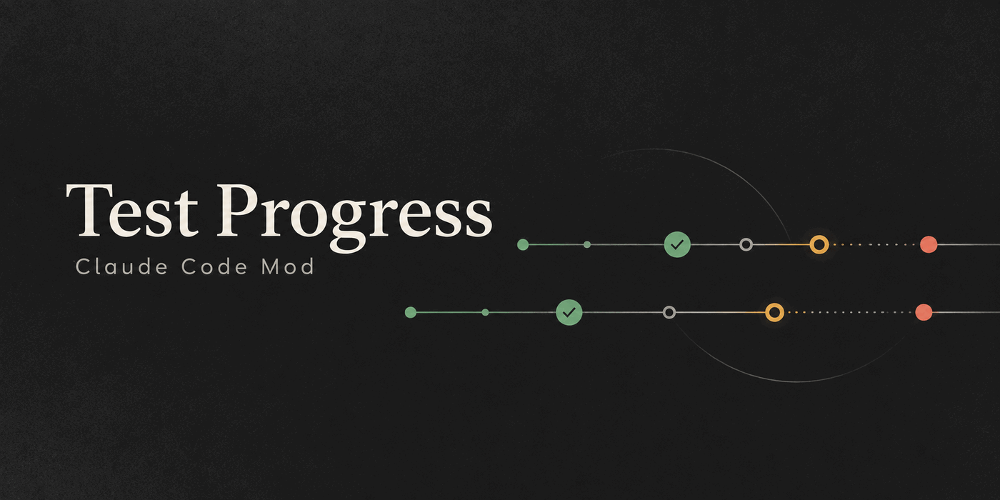

# Claude Test Progress



**Acompanhe seus testes no Claude Code enquanto eles rodam em segundo plano.**
O plugin `test-progress` apresenta os módulos declarados no seu workspace,
com contadores, estado e logs por ID. É um
[Claude Code Mod](https://code.claude.com/docs/en/plugins/mods/create)
independente da Anthropic. Versão **0.5.0**, licença **MIT**.
A capa é uma ilustração; a interface real é um painel de terminal:

```text
1/1/4  ▶ Todos  ↻ Apenas com erro                    ?
● ■ API       ━━━━━━━━━━━━  ~83%  ✓4 ✗1       0:57
✓ ▶ Cobrança  ✓12 · 12 testes                 0:08
✗ ▶ Web       erro                            1:40
    O comando terminou sem eventos de progresso reconhecidos;
    nenhum teste foi confirmado.
    → clique no nome para abrir o log · confira o "adapter" do módulo
○ ▶ Worker    —
```

O topo conta módulos com sucesso / com erro / total (S/E/T). `↻ Apenas com erro` reinicia só os módulos que falharam, e clicar no nome do módulo abre ou fecha o log.

`/test-progress` sem argumentos abre ou fecha o painel; o `×` do próprio Claude Code, Esc e `ctrl+x x` (com o painel em foco) também fecham. O Claude Code ainda não liga atalhos de teclado a slash commands, então abrir pelo teclado depende do comando.
```

A skill `test-progress:configure` permite pedir ao Claude que cadastre as suítes
do projeto ou explique um erro do painel.

Acima do prompt, uma faixa de uma linha resume o que está rodando e as falhas
ainda não vistas; ela some quando não há nada novo.

## Funcionalidades e limites

- Cadastro de zero a vários módulos; somente o workspace ativa módulos.
- Início explícito por ID ou `all`, consulta, logs e cancelamento por sessão.
- Painel e resumo acima do prompt, com alternativa textual `--text`.
- Runtime explícito: `inherit` ou `node-project`, independente do ID/linguagem.
- Início conjunto com preflight completo e barreira entre todos os workers.

Percentual é **testes resolvidos / total conhecido**, incluindo ignorados.
Total desconhecido não é zero; total parcial pode crescer. **100% não comprova
encerramento nem sucesso**: confira estado, falhas e código de saída. Não há
cobertura de código, estimativa de tempo ou integração automática com uma CI.
O plugin não instala runners, browsers ou runtimes.

## Compatibilidade resumida

| Base ou integração | Alcance e limite |
| --- | --- |
| Claude Code / coletor | Claude **2.1.289+**, Node **14+** para o coletor |
| Linux / WSL / Windows | Linux é o caminho exercitado; WSL usa esse caminho; Windows nativo tem gate próprio e aceite em VM Windows 11, ainda sem máquina física |
| Python | Python 3.8+, pytest 7+ ou unittest; integração serial |
| Ruby / RSpec | Ruby 3.1+, RSpec Core 3.13.x; integração serial |
| Rails / Minitest | Rails 7.2/8.0/8.1, Minitest >=5.20 e <7; `rack_test` não prova Selenium |
| Java / JUnit 5 | Java 17+, JUnit 5.14+; fallback Maven ou listener opcional; consulte o alcance do gate real |
| Angular / Karma | Reporter ou fallback; aceite em browser/app real é separado dos contratos |

Veja [versões testadas](docs/COMPATIBILITY.md).
O coletor usa seu próprio Node; `node-project` prepara o Node do aplicativo
respeitando a `.nvmrc`. `inherit` preserva o ambiente sem descobrir Node do app.
Linux/WSL usa Bash; descoberta nvm usa GNU `sort -V`. Windows usa PowerShell 5.1/7.

## Instalar e configurar

Com acesso SSH ao GitHub configurado, rode no Claude Code **um comando por vez**
(colados juntos, as linhas seguintes viram argumentos do primeiro):

```text
/plugin marketplace add git@github.com:fabiopbarbieri/claude-test-progress.git
```

```text
/plugin install test-progress@test-progress-marketplace
```

```text
/reload-plugins
```

Depois, `/test-progress help`, `/test-progress paths` e `/test-progress list`.

O marketplace próprio se chama `test-progress-marketplace`. Um workspace sem
cadastro pode ter zero módulos; listar ou abrir o painel não executa testes.
Instalação por terminal, clone SSH e `--plugin-dir`: [guia de uso](docs/USAGE.md).

Crie `.claude/test-progress.json` no diretório em que abriu a sessão. Exemplo
para um app Maven que já possui `mvnw` executável na raiz, em Linux/WSL:

```json
{
  "schemaVersion": 1,
  "modules": {
    "api": {
      "label": "API",
      "command": ["./mvnw", "test"],
      "cwd": ".",
      "adapter": "maven",
      "runtime": "inherit",
      "env": {}
    }
  }
}
```

`command` é **argv**: um elemento por argumento, sem expansão de shell ou de
`CLAUDE_PLUGIN_ROOT` no JSON. `cwd` é relativo ao workspace. Use os caminhos
absolutos de `/test-progress paths` para os [adapters](adapters/README.md).
Registry pessoal de templates é opcional; nunca ativa módulos sozinho.
[Configuração e templates](docs/USAGE.md#configurar-seu-projeto) · [Windows](WINDOWS.md).

## Comandos

| Comando | Ação |
| --- | --- |
| `/test-progress` ou `/test-progress status [id\|all]` | Abre/atualiza o painel sem iniciar testes |
| `/test-progress help` / `paths` | Ajuda / caminhos da instalação ativa |
| `/test-progress list` | Lista módulos e diagnósticos sem resolver ferramentas |
| `/test-progress start api` / `start all` | Inicia o módulo escolhido / todos os habilitados |
| `/test-progress logs api` / `logs all` | Consulta logs por módulo |
| `/test-progress cancel api` / `cancel all` | Solicita cancelamento na sessão responsável |

Acrescente `--text`, por exemplo `/test-progress status all --text`.
No painel: `▶` inicia, `■` cancela, clicar no nome do módulo abre os logs sob ele e `?` mostra a legenda.
[Suítes demoradas, owners e recuperação](docs/USAGE.md#testes-demorados-e-consultas-pelo-claude).

## Atualizar ou remover

**Encerre os jobs e confirme que não há recuperação pendente antes de trocar a
instalação.** Fechar painel, reload ou uninstall não para processos detached nem
comprova limpeza dos logs fora do cache. Após a confirmação de encerramento:

```bash
claude plugin marketplace update test-progress-marketplace
claude plugin update test-progress@test-progress-marketplace --scope user
```

Para remover, em vez de atualizar:

```bash
claude plugin uninstall test-progress@test-progress-marketplace --scope user
```

Ajuste o escopo instalado. Após atualizar, recarregue e reconsulte
`/test-progress paths` para ajustar os caminhos dos adapters no app.
[Procedimentos completos](docs/USAGE.md#atualizar-com-jobs-encerrados).

## Guias

[Uso](docs/USAGE.md) · [Compatibilidade](docs/COMPATIBILITY.md) ·
[Diagnóstico](docs/TROUBLESHOOTING.md) · [Windows](WINDOWS.md) · [Angular 9](ANGULAR9.md) ·
[Validação](docs/VALIDATION.md) · [Segurança](SECURITY.md) ·
[Contribuição](CONTRIBUTING.md) · [Extensões](docs/EXTENDING.md) ·
[CI e governança](docs/CI-GOVERNANCE.md) · [Licença MIT](LICENSE).
