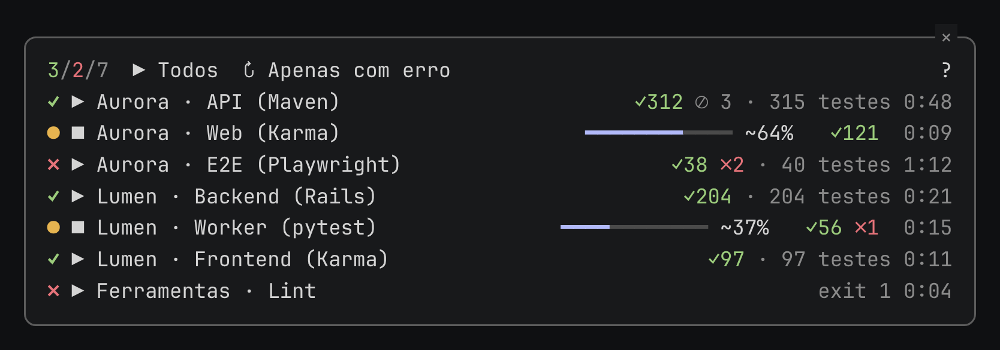

# Claude Test Progress


**Acompanhe suas suítes de teste no Claude Code enquanto elas rodam em segundo plano.**
Plugin `test-progress`, um [Claude Code Mod](https://code.claude.com/docs/en/plugins/mods/create)
independente da Anthropic. Versão **0.6.0**, licença **MIT**.



- **Um painel para todas as suítes:** Maven/JUnit, Karma/Angular, Playwright,
  pytest/unittest, RSpec, Rails/Minitest ou qualquer comando.
- **Progresso ao vivo:** barra, percentual, ✓ passaram, ✗ falharam, ⊘ ignorados e tempo.
- **Ações no próprio painel:** `▶` inicia, `■` cancela, `↻ Apenas com erro` reexecuta
  só o que falhou e clicar no nome abre o log com as cores do runner.
- **Resumo acima do prompt:** uma linha com o que está rodando e as falhas ainda não vistas.

O topo do painel conta módulos com sucesso / com erro / total. O percentual é
testes resolvidos / total conhecido; `~` indica total parcial, que ainda pode
crescer. **100% não comprova sucesso**: confira estado, falhas e código de saída.

## Instalar

Com acesso SSH ao GitHub configurado, rode no Claude Code **um comando por vez**
(colados juntos, as linhas seguintes viram argumentos do primeiro):

```text
/plugin marketplace add git@github.com:fabiopbarbieri/claude-test-progress.git
```

```text
/plugin install test-progress@test-progress-marketplace
```

```text
/reload-plugins
```

Depois, `/test-progress help`, `/test-progress paths` e `/test-progress list`.
Instalação por terminal, clone SSH e `--plugin-dir`: [guia de uso](docs/USAGE.md).

## Configurar

O jeito mais simples é pedir ao Claude: a skill `test-progress:configure`
cadastra as suítes do projeto e explica erros do painel.

O cadastro fica em `.claude/test-progress.json`, no diretório em que você abriu
a sessão. Exemplo para um app Maven com `mvnw` na raiz:

```json
{
  "schemaVersion": 1,
  "modules": {
    "api": {
      "label": "API",
      "command": ["./mvnw", "test"],
      "cwd": ".",
      "adapter": "maven",
      "runtime": "inherit"
    }
  }
}
```

`command` é argv (um item por argumento, sem shell). Para contar testes em
outras suítes, use os [adapters](adapters/README.md) pelo caminho absoluto
mostrado em `/test-progress paths`. Exemplos prontos, templates pessoais e
todos os campos: [configurar seu projeto](docs/USAGE.md#configurar-seu-projeto).

## Comandos

| Comando | Ação |
| --- | --- |
| `/test-progress` | Abre ou fecha o painel, sem iniciar testes |
| `/test-progress list` | Lista módulos e diagnósticos |
| `/test-progress start <id>` / `start all` | Inicia um módulo / todos os habilitados |
| `/test-progress logs <id>` | Mostra o log do módulo |
| `/test-progress cancel <id>` / `cancel all` | Cancela a execução |
| `/test-progress help` / `paths` | Ajuda / caminhos da instalação |

Acrescente `--text` para a saída em texto. No painel, `?` mostra a legenda.

Quando todas as execuções terminam e alguma falhou, o painel abre sozinho no log
do primeiro módulo com falha, inclusive para execuções iniciadas pelo Claude via
CLI. Ele não toma o teclado e, por ser aberto pelo mod, só aparece com o terminal
largo o bastante (144 colunas); fechado, não reabre para as mesmas execuções.

## Atualizar ou remover

**Encerre os jobs antes de trocar a instalação:** fechar o painel, recarregar ou
desinstalar não para processos em segundo plano.

```bash
claude plugin marketplace update test-progress-marketplace
claude plugin update test-progress@test-progress-marketplace --scope user
```

Para remover:

```bash
claude plugin uninstall test-progress@test-progress-marketplace --scope user
```

Depois de atualizar, confira `/test-progress paths` e ajuste os caminhos dos
adapters. [Procedimento completo](docs/USAGE.md#atualizar-com-jobs-encerrados).

## Compatibilidade

Claude Code **2.1.289+** e Node **14+** para o coletor. Linux e WSL são o caminho
principal; Windows nativo tem [guia próprio](WINDOWS.md). O plugin não instala
runners, browsers nem runtimes. Versões testadas por suíte:
[compatibilidade](docs/COMPATIBILITY.md).

## Guias

[Uso](docs/USAGE.md) · [Diagnóstico](docs/TROUBLESHOOTING.md) ·
[Compatibilidade](docs/COMPATIBILITY.md) · [Windows](WINDOWS.md) ·
[Angular 9](ANGULAR9.md) · [Validação](docs/VALIDATION.md) ·
[Extensões](docs/EXTENDING.md) · [Contribuição](CONTRIBUTING.md) ·
[CI e governança](docs/CI-GOVERNANCE.md) · [Segurança](SECURITY.md) ·
[Licença MIT](LICENSE)
