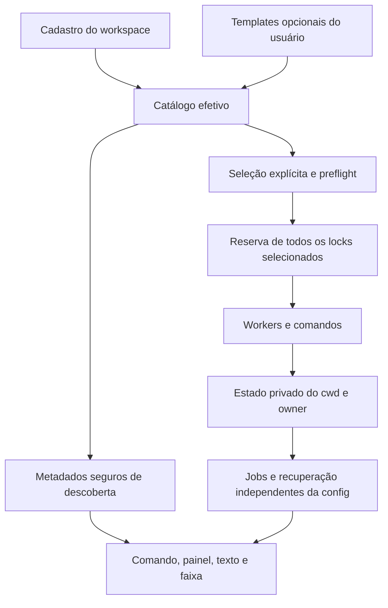

# Plano de módulos cadastrados

**Status: proposta técnica para revisão; runtime não implementado.** Avaliação
de 04/10/2026 sobre o snapshot
`50afab1ded934185b8482b37c6c4d0a3f0bb0778`, na branch
`feature/public-06-modules-plan`, derivada de `feature/public-03-validation`.
Essa base não representa o resultado final da PR #9. O plano é independente
do refinamento, das capturas e da CI dessa PR.

Este documento é a entrega de planejamento. Não autoriza implementação,
alterações de configuração global, merge, release, push ou abertura de PR.
As escolhas abaixo são recomendações revisáveis, não um schema já aprovado.
Preservar package `claude-test-progress`, plugin `test-progress`, marketplace
`test-progress-marketplace`, licença MIT, versão `0.1.0` e Node **14.0.0** como
mínimo do coletor. Git continua usando SSH.

## 1. Recomendação e decisões de escopo

**B. Adotar módulos 1..N**, com ID estável e runtime explícito. O usuário mantém
templates reutilizáveis; cada workspace declara quais módulos existem e estão
ativados. CLI, comando e painel consultam um mesmo catálogo efetivo. Começar
com cadastro por arquivos JSON e `/test-progress start <id>`; um editor de
cadastro e aliases de slash podem ser evoluções separadas.

**A. Manter as duas lanes e ocultar as ausentes** continua sendo a implementação
mínima da PR #9, em outra branch. Ela resolve o ruído imediato e documenta a
evolução. Não duplicar A nesta branch nem colocar B na PR #9. Entregar o plano
agora; a implementação futura deverá conferir o contrato final de descoberta
do parent antes de integrar, sem depender de acompanhar seu trabalho.

| Decisão | Recomendação | Consequência |
| --- | --- | --- |
| Ativação | Somente declarações do workspace ativam módulos | Um template global nunca cria botão ou job automaticamente |
| Identidade | ID seguro, estável, independente de label/linguagem | Dois módulos Python ou JVM permanecem independentes |
| Configuração | Workspace schemaVersion 2; registry com schemaVersion 1 próprio | Não confundir versão da configuração, resposta CLI e snapshot |
| Herança | Um `extends` opcional; substituição de campos inteiros | `command` e `env` não sofrem merge profundo |
| Runtime | `inherit` ou `node-project`, sem inferência pelo ID | Um módulo chamado `frontend` pode executar Ruby no schema 2 |
| Comando | `/test-progress` estável com seleção por ID | Cadastro disponível no fluxo de `/`; não prometer um slash por módulo |
| Estado | Namespace atual e arquivos antigos preservados | Workers ativos não são renomeados nem dependem da config atual |
| Todos | Seleção explícita, preflight completo e reserva de todos os locks | Erro de preflight/reserva inicia zero comandos |
| Cadastro inicial | Edição declarativa de JSON; descoberta somente leitura | Sem wizard, instalação de ferramentas ou execução no startup |

## 2. Problema, objetivos e limites

Hoje o projeto oferece exatamente `backend` e `frontend`. Isso mistura área
visual, identidade de execução, seleção de adapter e preparação de Node.
Workspaces com um módulo exibem ações irrelevantes; três módulos ou duas suítes
da mesma linguagem não cabem nesse modelo sem reutilizar uma lane.

O resultado pretendido é reconhecer o cadastro quando Claude inicia, permitir
selecionar seus módulos pelo comando e pelo painel, iniciar apenas os escolhidos
e acompanhar nome, linguagem, estado, contadores, logs e cancelamento de cada
execução. Um workspace pode ter zero, um ou vários módulos; a linguagem não é
uma chave de unicidade. Um módulo pode executar um único comando que reúna
várias suítes, desde que o adapter preserve a contagem observada.

São objetivos de compatibilidade: configuração legada sem edição obrigatória;
status/logs/cancel úteis sem configuração válida; isolamento por workspace e
owner; recuperação conservadora; Node 14.0.0 do coletor independente do runtime
do app; suporte planejado aos wrappers Bash e PowerShell 5.1/7.

Não fazem parte desta migração: autodetectar e ativar projetos por `package.json`,
Gemfile ou linguagem; executar testes ou instalar dependências durante descoberta;
alterar PATH global ou usar `nvm use/install`; criar um scheduler de dependências
entre módulos; controlar jobs de outro owner; descobrir outros workspaces;
acrescentar runners, watch, cobertura, ETA, Selenium ou suporte macOS. O editor
visual de cadastro, CRUD por slash, aliases individuais e um registry de
workspaces ficam fora do primeiro ciclo.

## 3. Interfaces atuais confirmadas

As evidências desta seção são do código do snapshot, não de uma CI consultada
nem da versão final do parent.

| Interface existente | Evidência e impacto na migração |
| --- | --- |
| [runner/state.mjs](../runner/state.mjs) | `LANES` enumera backend/frontend; `namespace` usa realpath do cwd + owner no hash; `files` produz snapshot, lock, claim e cancel por lane. `snapshots` também reconcilia perda do worker |
| [runner/cli.mjs](../runner/cli.mjs) | `argumentsOf` transforma `all` nas duas lanes antes de ler config. `configuration` valida somente as lanes selecionadas; individual já ignora dependência da outra. Todos os locks são reservados antes de `start` |
| [runner/frontend-runtime.mjs](../runner/frontend-runtime.mjs) | Somente frontend executa o resolvedor Node/.nvmrc. Backend recebe overrides de env e herda o ambiente. A preparação atual não é agnóstica de runtime |
| [runner/worker.mjs](../runner/worker.mjs) | Lê o job privado, verifica claim/runId e usa `job.lane` nos caminhos. Conserva lock quando a árvore não tem término comprovado; remove o job com env após conclusão segura |
| [scripts/run-collector.ps1](../scripts/run-collector.ps1) | `ValidateSet` restringe Lane a backend/frontend/all; parâmetros escalares e `-File` preservam o caminho compatível com PowerShell 5.1 |
| [runtime/windows-process.ps1](../runtime/windows-process.ps1) | O broker também rejeita `job.lane` diferente de backend/frontend. A generalização não termina no wrapper |
| [hooks/register.mjs](../hooks/register.mjs) | Cadastro `/test-progress`, parser, blocos, ações, texto e AbovePrompt fixam duas lanes. Polling compara jobs/erro/identidade, sem catálogo dinâmico. Já sincroniza owner/cwd e rejeita respostas antigas |
| [runner/progress.mjs](../runner/progress.mjs) | O parser já aceita auto/events/maven/karma sem depender de linguagem; a restrição por lane está na configuração |
| [runner/suite-language.mjs](../runner/suite-language.mjs) | Linguagem é dica de apresentação; não escolhe runtime ou adapter. Hoje o painel pode usar a linguagem como título da lane |

Status, logs e cancelamento não carregam a configuração para resolver
dependências. Preservar essa propriedade. Status não é estritamente sem escrita:
a reconciliação pode persistir evidência de recuperação no namespace privado.
Isso não permite escrever no cadastro do usuário ou do workspace.

Conforme a transferência, o parent pretende acrescentar `workspace.configStatus`
e `configuredLanes` à resposta schema 1, sem resolver ferramentas na descoberta;
`all` selecionará somente lanes configuradas e jobs ativos/recuperações
continuarão visíveis. Esses detalhes são contexto fornecido, não implementação
revalidada nesta base. B deve reutilizar essa separação, conferindo nomes e
semântica finais na integração futura.

Alguns documentos atuais registram SHAs e evidências anteriores. Consultar os
[workflows](../.github/workflows/quality.yml) e os gates locais para planejar
verificação; não transformar uma matriz declarada ou um registro antigo em
evidência de execução no HEAD deste plano.

## 4. Vocabulário e contrato de cadastro proposto

**Módulo de testes** é uma declaração de execução no workspace. **Template** é
um conjunto opcional de defaults do usuário. **Catálogo efetivo** é a resolução
das declarações do workspace com os templates referenciados. **Job** é uma
execução, identificada por module ID + runId dentro do namespace cwd + owner.
Um módulo pode existir sem job; um job pode continuar existindo sem módulo.

### 4.1 Fontes e ativação

| Fonte | Localização proposta | Regra |
| --- | --- | --- |
| Workspace | `.claude/test-progress.json` sob o cwd canônico da sessão | Fonte única de ativação e dos IDs; ausência é situação normal |
| Override CLI | `--config <arquivo>` | Substitui a fonte workspace por invocação; relativo ao cwd da sessão, não ao diretório do arquivo |
| Usuário | `test-progress.registry.json` dentro de `CLAUDE_CONFIG_DIR`, quando definido; senão `~/.claude` | Só templates. Arquivo ausente equivale a registry vazio; nenhuma criação automática |

Respeitar `CLAUDE_CONFIG_DIR` é uma escolha do plugin alinhada ao diretório de
configuração documentado pelo Claude; o arquivo registry é nosso contrato,
não um formato definido pela Anthropic. No Windows o default corresponde ao
diretório `.claude` do perfil. Não ler `.claude.json`, settings, tokens ou outros
arquivos do usuário para obter o registry.
[Fonte oficial sobre diretório de configuração](https://code.claude.com/docs/en/settings).

Exigir `CLAUDE_CONFIG_DIR` absoluto quando definido; não expandir texto de shell
ou resolver esse diretório relativamente a cada workspace. Valor inválido gera
diagnóstico do registry e afeta somente módulos que precisam de templates.
Módulos standalone e gerenciamento de jobs permanecem independentes.

O workspace é o `--cwd`/cwd da sessão, como hoje. Não procurar automaticamente
na raiz Git ou nos ancestrais, o que mudaria o namespace e a seleção. Registry
não associa caminhos pessoais a workspaces. `--config` não altera owner,
namespace ou chaves de lock; duas configs no mesmo cwd/owner com o mesmo ID
competem pelo mesmo lock.

No primeiro ciclo `--config` continua sendo opção do coletor/CLI e do wrapper
Windows. O painel usa o arquivo default da sessão e a mesma interface de
resolução. Jobs iniciados por CLI com config alternativa continuam visíveis
nesse painel; iniciar de novo nele usa o cadastro default. Não inferir uma
config persistente pelo último job. Se um override de painel for necessário,
definir depois seu parser de caminhos com espaços e duração por sessão.

### 4.2 Formatos ilustrativos

Registry proposto; não é instalado ou criado por este plano:

```json
{
  "schemaVersion": 1,
  "templates": {
    "jvm-tests": {
      "language": "JVM",
      "cwd": ".",
      "command": ["mvn", "test"],
      "adapter": "maven",
      "runtime": "inherit",
      "env": {}
    },
    "karma-tests": {
      "language": "TypeScript",
      "cwd": ".",
      "command": ["npm", "test", "--", "--watch=false"],
      "adapter": "karma",
      "runtime": "node-project",
      "env": {}
    }
  }
}
```

Workspace com dois módulos JVM independentes e um módulo web:

```json
{
  "schemaVersion": 2,
  "modules": {
    "api": {
      "extends": "jvm-tests",
      "label": "API principal",
      "cwd": "services/api",
      "order": 10
    },
    "billing": {
      "extends": "jvm-tests",
      "label": "Faturamento",
      "cwd": "services/billing",
      "order": 20
    },
    "web": {
      "extends": "karma-tests",
      "label": "Aplicação web",
      "cwd": "web",
      "order": 30,
      "enabled": true
    }
  }
}
```

Os comandos são exemplos de projetos que já possuem Maven ou um target npm
integrado com Karma. Não instalam runners/reporters e não garantem progresso
em qualquer app. A integração de eventos continua sendo responsabilidade do
adapter do projeto, conforme [EXTENDING](EXTENDING.md).

Registry não é obrigatório. Um módulo completo pode existir somente no
workspace; um cadastro vazio explícito é `{"schemaVersion":2,"modules":{}}`.

```json
{
  "schemaVersion": 2,
  "modules": {
    "tests": {
      "label": "Testes do projeto",
      "command": ["node", "tools/progress-tests.mjs"],
      "adapter": "events",
      "runtime": "inherit"
    }
  }
}
```

Nesse exemplo o projeto fornece `tools/progress-tests.mjs` e emite o protocolo
de eventos. Não há interpolação automática de placeholders, variáveis ou
caminhos do plugin em `command`; `/test-progress paths` segue disponível para
o usuário localizar adapters instalados.

### 4.3 Campos, defaults e precedência

| Campo do módulo | Contrato recomendado |
| --- | --- |
| Chave em `modules` | ID validado; único no workspace |
| `extends` | ID de um único template do registry; opcional; não é caminho/URL |
| `enabled` | Boolean; default true para declaração do workspace; somente workspace |
| `label` | String Unicode, trim, 1..64 caracteres sem controles; default ID |
| `language` | Dica opcional de apresentação, trim, 1..40 sem controles, mantendo limite atual |
| `cwd` | String sem NUL; default `.`; relativo ao workspace, inclusive quando vem do template |
| `command` | Array não vazio de strings sem NUL; primeiro argumento não vazio; obrigatório após resolução |
| `adapter` | `auto`, `events`, `maven` ou `karma`; default `auto` |
| `runtime` | `inherit` ou `node-project`; default `inherit` no schema 2 |
| `env` | Map de strings; default `{}`; não contém instruções de expansão |
| `order` | Inteiro finito; default 0; somente workspace; empate ordenado por ID ASCII |

Template pode oferecer label, language, cwd, command, adapter, runtime e env;
não oferece enabled/order nem herança de outro template. Restringir a uma camada
evita ciclos, resolução remota e regras difíceis de revisar. Campos desconhecidos
devem produzir diagnóstico explícito no escopo correspondente, sem execução
silenciosa por typo. Erros de command/env/runtime/adapter são validados para
start somente dos módulos selecionados.

Precedência: defaults do schema → campos do template referenciado → campos
explicitamente presentes no workspace. Campo omitido herda; campo `null` é
inválido, não significa apagar. `command` substitui o array inteiro. `env`
substitui o map inteiro: se template contém `A` e `B`, workspace com `env:{"A":"x"}`
não conserva `B`. `env:{}` elimina overrides do template, mas o processo ainda
herda seu ambiente. Em seguida o worker combina o ambiente herdado com esse map;
`node-project` acrescenta o diretório do Node selecionado ao PATH **do filho**.

Validar env como hoje: chave não vazia, sem `=`/NUL; valor string sem NUL.
No Windows, rejeitar chaves duplicadas por caixa dentro do mesmo map, como
`PATH`/`Path`, antes de combinar com o ambiente herdado. Nenhum env vai para
metadados de descoberta ou apresentação do catálogo.

Uma referência inexistente torna inválido **aquele módulo**, mesmo que tenha
overrides suficientes; não ignorar `extends` silenciosamente. Registry malformado
ou ilegível prejudica referências a ele, com diagnóstico; módulos completos
locais continuam utilizáveis. Template não referenciado, mesmo inválido, não
bloqueia outro módulo. Workspace com JSON inválido/schema desconhecido impede
novos starts, mas não impede consultar e cancelar jobs já conhecidos.

### 4.4 Segurança de IDs, textos e caminhos

Propor IDs de 1..48 caracteres ASCII minúsculos, com regex
`^[a-z][a-z0-9-]{0,47}$`. Rejeitar `all` (seleção agregada), `constructor`,
`prototype` e nomes de dispositivo Windows `con`, `prn`, `aux`, `nul`,
`com1`..`com9`, `lpt1`..`lpt9`. Aplicar a mesma regra em Node, wrapper/broker
PowerShell e leitura de estado; não transformar caixa ou pontuação implicitamente.
`backend` e `frontend` continuam válidos. A restrição de nomes Windows inclui
arquivos com extensão; só excluir separadores não basta.
[Fonte Microsoft sobre nomes reservados](https://learn.microsoft.com/en-us/windows/win32/fileio/naming-a-file).

Label não vira caminho, comando, alias ou chave de lock. Labels iguais são
permitidos; apresentar também o ID para distingui-los. Mudança de label,
language ou order não cria um novo job. Usar `Map` ou objeto sem prototype ao
indexar entradas externas. Rejeitar IDs inválidos antes de compor qualquer
caminho; não "sanear" dois IDs diferentes para o mesmo nome de arquivo.

Resolver cwd com `path.resolve(workspace, cwd)` e `realpath`/verificação de
diretório. Paths relativos de comandos são avaliados no cwd do módulo;
relativos de `--config`, no workspace. Caminhos com espaços são argumentos,
não texto de shell. Preservar o legado que aceita cwd explícito fora da árvore;
indicar execução externa no painel. Não acrescentar confinamento incompatível
por inferência. Descoberta pode testar presença de diretórios, sem invocar
executáveis; revalidar no preflight para mudanças entre leitura e start.

Enumerar estado somente no namespace privado, por nomes que correspondam aos
IDs seguros e sufixos esperados. Rejeitar links e escapes nos arquivos privados;
`logPath`/job path devem corresponder ao namespace, ID e runId observados.
Não aceitar caminho arbitrário vindo de um snapshot para ler logs ou apagar
arquivos. Caso legado não possa ser autenticado por esse contrato, conservar
um diagnóstico e exigir recuperação explícita; não apagar a evidência.

Sanear controles/ANSI em labels, diagnósticos e apresentação de logs. Manter
os arquivos privados, mode 0700/0600 em POSIX e DACL verificada no Windows.
Jobs podem conter env enquanto executam e devem continuar privados. Exemplos,
testes e evidências públicas usam apenas dados sintéticos; não ler ou publicar
credenciais, configs reais, caminhos pessoais ou logs autenticados.

## 5. Descoberta e interface compartilhada

Concentrar resolução de configuração em um módulo interno profundo, por exemplo
`runner/module-config.mjs`, com duas operações conceituais:

| Interface proposta | Responsabilidade e resultado |
| --- | --- |
| `discoverModules(context, sources)` | Ler fontes, normalizar legado, resolver templates e conferir metadados/presença; retornar catálogo e diagnósticos seguros. Não resolver runtimes nem executar suítes |
| `prepareSelection(catalog, target)` | Capturar os IDs selecionados e validar somente eles: execução, env, adapter, cwd, runtime e primeiro executável. Retornar descritores privados imutáveis ou falhar antes de reservar/iniciar |

Esses nomes são interfaces de projeto a revisar, não exports já implementados.
O Mod não deve importar um módulo com `fs`, `child_process` ou outras APIs Node:
ele chama o coletor por `$.process.run` e recebe sua projeção. CLI e painel não
duplicam a leitura/precedência ou descobrem módulos por linguagens distintas.



Metadados permitidos: ID, label, language opcional, order, enabled, presença do
diretório, origem workspace/template/legado e código de diagnóstico do cadastro.
Não retornar env, command, conteúdo de arquivos, caminho do registry ou saídas
de resolvedores nessa projeção. "Diretório presente" não significa que as
dependências foram validadas. Dependências permanecem `não verificadas` até
seleção. Não sondar Python/Ruby/Maven/browser/Node do app na descoberta.

O bootstrap precisa localizar Node 14+ **do coletor** até para status; isso é
distinto da preparação do runtime dos módulos. Falha no bootstrap gera erro
curto de consulta, preserva última evidência na mesma identidade e permite retry.
Ela não autoriza fallback que inicie uma suíte ou leia outra sessão.

### 5.1 Resposta CLI e snapshots

Recomendar evolução aditiva da resposta schema 1: `modules` para metadados e
`jobs` como map por ID, mantendo `lanes` como projeção **apenas** de
backend/frontend para leitores antigos. A configuração schema 2 não exige
renumerar snapshots nem modificar o significado do protocolo de progresso.
Incluir uma capability explícita, por exemplo `modules-v2`, para o hook novo
detectar a projeção; aceitar respostas antigas sem ela pelo adaptador legado.

Conservar `workspace.configStatus`/`configuredLanes` do contrato final do parent;
não atribuir novos valores incompatíveis ao mesmo campo. Acrescentar a versão
da config e diagnósticos por módulo em campos novos. O enum exato e os nomes
de payload devem ser congelados em P1 depois dessa conferência.

`jobs` inclui IDs configurados e IDs presentes no estado, inclusive ativos e
recuperações removidas do cadastro. `lanes` conserva seus nulls legados. Não
duplicar um mesmo job nas duas projeções para contagem. A resposta de uma ação
pode trazer o estado completo do namespace; seleção limita operações, não
elimina do painel os demais jobs. Logs acrescentam tails somente dos alvos.

Erros de cadastro aparecem como diagnóstico; status/logs/cancel continuam
consultando estado mesmo com esses erros. `ok:false` de start deve vir com os
jobs preservados. Erros de estado devem ser isolados por ID quando possível;
um arquivo corrompido não pode apagar a evidência dos demais jobs nem permitir
start daquele ID. Falha de segurança no namespace é erro global e fecha acesso.

Nos snapshots novos, manter `schema:1`, `lane:<id>` como chave técnica compatível
com worker, acrescentando `moduleId:<id>`, label/language de execução e runtime
quando necessário. Se ambos os IDs estiverem presentes, exigir igualdade.
Não renomear `lane` no job privado nesta migração; remover a enumeração fixa
é suficiente. Snapshot antigo sem moduleId usa lane/nome validado do arquivo.

Manter o protocolo `@@TEST_PROGRESS@@`, scopes dentro de cada job, código de
saída nativo, `resolved = passed + failed + skipped`, total desconhecido distinto
de zero e ausência de percentual inventado. Cadastros da mesma linguagem não
somam contadores nem compartilham cancelamento.

### 5.2 Catálogo visível e alterações ao vivo

Para o painel normal, percorrer módulos explicitamente enabled, incluindo
diagnósticos de cadastro desses módulos; não listar templates globais,
declarações disabled com job ausente/terminal ou registros terminais de módulos
removidos.
Um diretório ausente é diagnóstico, sem botão de iniciar, e não um módulo
executável detectado. Assim "ativado" não se confunde com "dependências prontas".

Acrescentar sempre os jobs ativos ou com recuperação pendente, ainda que sua
declaração tenha sumido, esteja disabled, o diretório tenha desaparecido ou o
arquivo inteiro esteja inválido. Um job terminal removido segue consultável
por ID via CLI/logs, mas não ocupa a visão normal. Não apagar seu estado por
essa regra de visibilidade. Locks sem snapshot válido precisam de entrada de
diagnóstico/recuperação; não podem desaparecer apenas por falta do cadastro.

Ordenar primeiro os módulos enabled por order/ID; acrescentar os jobs retidos
sem declaração enabled por início/ID, sem mudar sua chave. Reativar o módulo
devolve seu bloco à posição do catálogo, preservando o runId e a seleção de logs.

Atualização de command/env/cwd/template aplica-se somente à **próxima** execução.
O job atual usa seu descritor capturado. Label e order do catálogo atualizam a
apresentação ao vivo; os detalhes do job conservam a identificação capturada
no início. Quando não há catálogo utilizável, usar label do snapshot ou ID.
Remoção/desativação bloqueia novo start, preservando status, logs e cancelamento.

## 6. Execução, locks e recuperação

### 6.1 Seleção e preflight

1. Canonizar cwd e obter owner; validar alvo seguro. Resolver o cadastro para
   start. Status/logs/cancel fazem descoberta de estado sem depender dessa etapa.
2. Individual seleciona somente aquele ID enabled. `all` captura todos os IDs
   explicitamente enabled do workspace, em ordem estável, sem escolher templates
   globais. Nenhum enabled: start falha com mensagem de cadastro, sem criar job.
3. Validar todos os selecionados antes de qualquer start. Um módulo enabled
   inválido **não** é silenciosamente omitido de `all`; o conjunto inteiro falha.
   Um módulo disabled ou não selecionado não exige suas ferramentas.
4. Resolver runtime/cwd/env/adapter e disponibilidade do primeiro executável,
   com as regras reais de PATH/plataforma. Não executar a suíte para validá-la,
   nem validar todas as suas dependências internas. Gerar descritores privados
   de uma mesma leitura; não reler templates diferentes no meio do lote.
5. Revalidar a identidade da sessão antes da ação no hook e os dados de caminho
   antes da reserva. Se cadastro mudou durante preflight, abortar e pedir retry,
   usando revisão interna do cadastro; não publicar hash de env como metadado.
6. Reconciliar estado, reservar **todos** os locks selecionados em ordem por ID
   antes de lançar workers. Conflito/recuperação num ID libera só as reservas
   desse pedido, identificadas por runId; inicia zero comandos.
7. Preparar jobs, snapshots e workers; iniciar e devolver estado sem aguardar
   término das suítes. Snapshot/log/env ficam vinculados ao ID/runId capturados.

`all` não é uma DAG e order não é ordem de dependência entre processos. Capturar
o conjunto evita que uma edição durante a operação acrescente um módulo que
nunca passou por preflight. Um start individual enquanto outro ID está ocupado
continua permitido; o mesmo ID nunca tem duas execuções no mesmo namespace.

### 6.2 O que significa "all falha sem início parcial"

A garantia obrigatória é **zero comandos de usuário iniciados** para erros de
cadastro, template, runtime, executável direto ou reserva de lock. Os testes
devem verificar um marcador de início de cada fixture; `ok:false` sozinho não
prova ausência de execução.

Hoje `start` lança workers sequencialmente; se um lançamento tardio falhar,
os anteriores podem ter iniciado e recebem pedidos de cancelamento. Reserva
prévia não torna esse trecho atômico. O plano não deve prometer ausência de
início parcial em falhas arbitrárias do sistema operacional depois desse ponto.

Recomendar uma barreira de preparação para o lote em P3: todos os workers ficam
em fase preparada, sem spawn do comando do usuário, publicam ready para ID/runId,
e só avançam após autorização privada do coordenador. Timeout, falha de criação
de job ou worker antes dessa liberação aborta o lote, encerra workers preparados
e libera reservas somente após confirmação. O arquivo/claim de lote precisa
de identidade do coordenador, lista de runIds e prazo limitado; morte do
coordenador antes da liberação não pode deixar workers aguardando eternamente.

Após a liberação, uma falha de spawn/exec ou morte de worker ainda pode coexistir
com comandos que começaram. Cancelar apenas os runIds desse lote, manter locks
até confirmar término das árvores e relatar quais iniciaram, cancelaram ou
exigem recuperação. Isso é compensação, não transação de efeitos das suítes.
A barreira é recomendação para fortalecer preparação; o gate de zero início
do preflight/reserva não depende de aceitar essa extensão. Se "nenhum início"
for exigido também após liberação em todas as falhas, o requisito não é garantível
para comandos independentes e precisa ser reformulado antes de implementação.

### 6.3 Invariantes de estado e cleanup

| Invariante | Regra a preservar/generalizar |
| --- | --- |
| Namespace | Mesmo hash de cwd canônico + NUL + owner; não acrescentar config path, label ou linguagem |
| Exclusão por ID | Manter `<id>.lock`, claim e gate `<id>.mutation`; `mkdir` é o gate entre processos |
| Ownership | Operações de cancel, release, cleanup e prova conferem runId; nunca sinalizar PID arbitrário |
| Gate de mutação | Não recuperar por idade/PID o gate de seção crítica; falhar fechado como hoje |
| Worker perdido | Morte do líder/worker não comprova fim dos descendentes; conservar lock quando árvore presente/desconhecida |
| Recuperação | Usar identidade/prova conservadora existente; desconhecida exige ação manual, sem matar um PID presumido |
| Config removida | Descoberta de estado não depende de IDs da configuração; ativo/recuperação continua consultável |
| Escrita | Snapshot/claim/prova por atualização atômica, restrição de acesso e verificação de identidade |
| Cleanup | Remover job privado com env, cancel do mesmo runId e sidecar só depois de término seguro; conservar snapshot/log conforme política atual |
| Aborto de lote | Não liberar lock de comando vivo nem apagar claim de outra tentativa; uma reserva não lançada é liberada pelo próprio runId |

O reader de estado deve descobrir IDs por snapshots **e** locks/claims nos
arquivos imediatos do namespace, com validação de tipo/nome. Não fazer varredura
global de temp ou confiar somente na lista configured. Incluir backend/frontend
legados mesmo sem catálogo. Preservar diagnósticos para snapshot/claim divergente,
gate abandonado e lock sem snapshot, bloqueando novo start até reconciliação
segura. Logs e cancel de ID conhecido pelo estado funcionam sem template/cwd
do módulo; o cwd base ainda precisa permitir identificar o namespace.

Cancelamento `all` trabalha sobre jobs ativos/recuperáveis do **estado**, e não
apenas módulos enabled. Processar e reportar resultado por ID, inclusive os que
exigem recuperação manual; não abandonar outros pedidos seguros no primeiro
erro. Logs/status `all` incluem o estado consultável, sem acessar outros owners.
Erro/timeout de consulta não equivale a job parado. Fechar painel, reload,
`/clear`, `/resume`, `/branch` ou encerrar Claude não cancela implicitamente jobs.

## 7. Adapter, runtime, bootstrap e Windows

Runtime responde "com qual ambiente executar"; adapter responde "como observar
progresso"; language responde "como descrever". Nenhum deles depende do ID ou
label. Dois módulos com `language:"JVM"` podem ter adapters, comandos e cwd
diferentes. A mesma integração events pode acompanhar Python ou Ruby.

| Runtime | Comportamento proposto |
| --- | --- |
| `inherit` | Ambiente herdado + env efetivo; sem descoberta .nvmrc ou runtime de linguagem. Command argv genérico, incluindo Node explicitamente configurado |
| `node-project` | Reutilizar resolvedores atuais do frontend, parametrizados pelo módulo: .nvmrc, escolha absoluta de Node, PATH só do filho e validação de Node explícito divergente |
| Legado backend | Normalizar para inherit, mantendo validação legacy de adapter |
| Legado frontend | Normalizar para node-project, inclusive quando a linguagem informada é outra |

Um módulo schema 2 com ID frontend e runtime omitido usa inherit. Para preservar
o comportamento antigo, a migração escreve node-project explicitamente. Não
inferir runtime por `npm`, TypeScript, label ou linguagem. Reutilizar inicialmente
`runner/frontend-runtime.mjs` via interface genérica; renomear arquivo/função só
depois, sem remover a compatibilidade enquanto jobs estão em andamento.

O collector usa Node >=14.0.0; o app pode precisar de Node 12 para Angular 9 ou
outro runtime. Não usar APIs surgidas depois de 14.0.0 sem fallback, incluindo
`crypto.randomUUID`, `fs.rmSync` e depender do evento spawn mais novo. Manter
os fallbacks existentes em [runtime.mjs](../runner/runtime.mjs) e testar o mínimo
em execução. O Mod/test kit/instalador Claude têm runtime próprio.

Usar argv sem shell implícito; checagem de executável não executa `--version` de
toda linguagem. No Windows `.cmd`/`.bat` requerem tratamento de shell; continuar
com resolução/quoting restritos de [windows-shell.mjs](../runner/windows-shell.mjs),
sem trocar por `shell:true` genérico.
[Referência Node 14 para child_process e batch](https://nodejs.org/download/release/v14.0.0/docs/api/child_process.html).

O wrapper PowerShell ganha alvo escalar `Module` e conserva `Lane` como alias
de compatibilidade; se ambos forem fornecidos e conflitarem, rejeitar. O Node
aceita `--module <id|all>` e o alias `--lane` pelo mesmo princípio. Validar ID no
wrapper e novamente no broker/Node, retirando **ambas** as enumerações fixas.
Alvos prefixados por opção, paths ou IDs de dispositivo são rejeitados.
Se houver ação discover dedicada, atualizar também o ValidateSet de Action.
Permanecer em `-File` e argumentos escalares; PowerShell 5.1 tem limitações para
parâmetros array pela linha nativa.
[Referência PowerShell 5.1](https://learn.microsoft.com/en-us/powershell/module/microsoft.powershell.core/about/about_powershell_exe?view=powershell-5.1).

Windows continua usando Job Object nomeado por runId, broker com identidade
comprovada, DACL e sidecar de containment/treeEmpty. Não derivar o nome do Job
Object da label. A documentação Microsoft descreve encerramento da árvore por
Job Object e o efeito de KILL_ON_JOB_CLOSE; isso fundamenta o mecanismo, não
comprova nossa implementação numa máquina real.
[Referência Microsoft Job Objects](https://learn.microsoft.com/en-us/windows/win32/procthread/job-objects).

Não alterar descoberta global de Node nem políticas de shell como parte do
cadastro. Linux/WSL seguem Bash; Windows nativo segue PowerShell e Win32. A
enumeração dinâmica deve preservar provas schema 1 e filenames de jobs antigos.
IDs novos precisam de cancelamento/recuperação testados em PowerShell 5.1 e 7.

## 8. Comando, startup e lifecycle

### 8.1 Contrato de slash recomendado

| Uso proposto | Resultado |
| --- | --- |
| `/test-progress` ou `status` | Descobrir/consultar e abrir painel; nunca iniciar testes |
| `/test-progress list` | Mostrar módulos ativados, IDs, linguagens e diagnósticos do workspace |
| `/test-progress start api` | Preparar/iniciar apenas o ID api |
| `/test-progress start all` | Preparar/iniciar conjunto enabled completo |
| `/test-progress logs web` | Consultar job/log do ID web, mesmo removido do cadastro |
| `/test-progress cancel all` | Cancelar jobs ativos/recuperáveis da sessão, inclusive módulos removidos |
| `/test-progress status api --text` | Resposta textual sobre seleção, preservando identidade e erros úteis |
| `help`, `paths`, `--demo`, `demo` | Preservar funções existentes e identificar dados sintéticos |

No coletor, equivalentes usam `--module`; manter `--lane backend|frontend|all`
e também IDs seguros como alias durante a transição. No slash, preservar os
atalhos legados `backend`, `frontend`, `all` como start. IDs arbitrários usam
`start <id>` para evitar colisões com verbos como help/status/list. Labels com
espaços não são alvos e nunca precisam de quoting. Alvo desconhecido retorna
erro com IDs disponíveis, sem converter para all. Disabled rejeita start, mas
um job conhecido continua acessível por status/logs/cancel.

Registrar `/test-progress` ainda que o cadastro esteja vazio/inválido. No menu
`/`, o comando abre o fluxo que lista os módulos; description/argumentHint podem
apresentar um resumo limitado dos IDs atuais. Não prometer autocomplete de
argumentos dinâmicos ou uma entrada `/tp-api` para cada módulo no MVP. Essa
interpretação de "disponibilizar no comando /" precisa constar do aceite.

A API documentada oferece registro e tratamento de comandos com args; `immediate`
permite ações durante um turno. Colisão com builtin é recusada, e registro
precisa de tratamento de erro para não impedir polling.
[Fonte oficial da API de comandos](https://code.claude.com/docs/en/plugins/mods/api).

### 8.2 Lifecycle e reconciliação

`session.start` ocorre antes do primeiro prompt por Mod carregado e reaparece
no reload; não reaparece após `/clear`, `/resume` ou `/branch`. Esses fluxos
encerram/trocam a sessão sem recarregar o Mod.
[Fonte oficial de lifecycle](https://code.claude.com/docs/en/plugins/mods/reference).

No startup, instalar polling e registrar o comando com descrição genérica mesmo
se uma consulta de cadastro falhar. Consultar metadados/estado com timeout curto,
sem start/demo automático. Atualizar hint quando houver catálogo e ownership
do comando confirmados. Tratar erro de registro separadamente da consulta; não
deixar a sessão sem polling por colisão. Recriar apenas um timer no reload.

Antes e depois de cada consulta, ação ou tick, obter `$.session.cwd()` e
`$.session.id()`. Mudança de identidade incrementa generation, limpa catálogo,
seleção de logs, jobs apresentados e erros anteriores; respostas da generation
antiga não atualizam UI. Ação iniciada antes de mudança de sessão continua no
owner capturado e nunca é repetida automaticamente na nova sessão. Ao voltar
ao owner anterior, seus jobs são reencontrados pelo estado.

Callbacks de botão também capturam a generation/identidade da renderização.
Se a pessoa aciona um bloco antigo após troca de owner/cwd ou mudança material
do catálogo, recusar a ação e atualizar a visão; não executar o ID homônimo da
nova sessão só porque ele existe lá. O preflight sempre lê o cadastro atual.

Polling invalida UI por alteração de identidade, catálogo (IDs, label, language,
order, enabled, presença e diagnósticos), jobs, busy, erro e seleção de logs.
Comparar projeção segura determinística, não só os snapshots. Uma edição de
label/order sem teste rodando deve redesenhar. Mudança de template com impacto
somente em execução invalida a revisão interna usada pelo start. Consultas não
se sobrepõem; logs em foco não suprimem descoberta do catálogo e dos outros jobs.
Preservar o tick nominal de 1 segundo inicialmente e medir custo no aceite;
cache por fonte com invalidação por conteúdo deve detectar edições atômicas.

O namespace da API publicado tem `register`, `run` e `list`; não há `unregister`
documentado nos tipos consultados. `list` pode informar source/plugin; os tipos
dizem que registrar de novo substitui o nome. **Recomendação nossa:** antes de
atualizar, verificar que o comando pertence a test-progress; nunca sobrescrever
comando de outro plugin/usuário nem depender de ownership ausente. Se identidade
de origem for incerta, manter cadastro genérico e usar lista dentro do painel.
[Tipos oficiais de comandos](https://raw.githubusercontent.com/anthropics/claude-code/refs/heads/main/mods/types/claude-code.d.ts).

Aliases `/tp-<id>` ficam adiados. Se escolhidos depois, precisam de prefixo e
limites de nome, verificação de colisão, ownership, dispatch pelo catálogo
**atual**, revalidação de enabled/cwd/owner e política para aliases obsoletos
que não podem ser removidos. Alias obsoleto deve responder "módulo indisponível",
sem iniciar. Reload/troca de sessão não é substituto silencioso para uma política
de reconciliação. Revalidar a API/tipos gerados pela versão instalada antes de
decidir sobre aliases; o reference oficial alerta que o GitHub pode diferir.

## 9. Experiência do painel e texto

Modo de uso: **operar testes**. A pessoa abre o painel para escolher uma suíte,
saber o que está acontecendo e acessar cancelamento/logs. Preservar o desenho
nativo atual, com lista vertical de módulos, contadores observados e ações
próximas ao job. Não criar um dashboard de linguagens nem substituir títulos
dos módulos por "Python" ou "JVM".

Hierarquia de cada bloco: label e ID distinguível; linguagem como informação
secundária; estado/fase, contadores/progresso; ações Iniciar, Ver logs e Cancelar
conforme evidência; detalhes de execução e erros quando úteis. Linguagem ausente
é "não informada" antes do job; inferência lexical existente pode descrever
snapshot legado, mas nunca selecionar runtime. O job sem progresso reconhecido
não recebe percentual fictício; total desconhecido e zero têm textos diferentes.

| Situação | Apresentação e ações |
| --- | --- |
| Nenhum módulo/job | Texto "Nenhum módulo ativado neste workspace", origem do cadastro e acesso a help; sem lanes vazias, starts ou Todos |
| Registry com muitos templates, workspace vazio | Mesmo estado vazio; templates não ocupam painel/faixa |
| Um enabled presente | Um bloco e start individual; sem botão Todos |
| Dois ou mais enabled | Blocos ordenados; Todos disponível somente com todos os alvos válidos para start |
| Enabled com erro de template/cwd | Diagnóstico do módulo sem start; Todos não omite esse ID e fica indisponível se qualquer alvo enabled estiver inválido |
| Dependência ainda não verificada | Start permitido a chamar preflight, sem selo falso de "pronto"; erro selecionado aparece no módulo |
| Running/preparing | Estado e atividade; logs e cancel; start do mesmo ID indisponível |
| Removido/disabled com job ativo | Bloco "Módulo removido/desativado", usando evidência do job; logs/cancel; sem novo start |
| Recuperação comprovadamente cancelável | Mostrar recuperação pendente e ação de cancelar órfão, preservando lock até confirmação |
| Recuperação desconhecida | Erro e orientação de recuperação segura, sem ação que mate PID presumido |
| Config inválida com jobs | Erro de cadastro separado dos blocos ativos/recuperação; logs/cancel continuam funcionando |
| Terminal configurado | Resultado/exit code e logs; novo start quando enabled e livre |

Todos aparece somente com **pelo menos dois enabled** no catálogo; recuperação
retida não entra nessa contagem. Sua ação usa exatamente o conjunto enabled do
coletor. O botão não inicia um subconjunto "saudável" quando outro falha; erro
de dependência descoberto no preflight mantém o lote sem início. Busy de consulta
mantém feedback e impede repetição de ação; não confundir com job em execução.

O seletor de logs guarda ID e runId. Nova execução do mesmo ID não troca logs
silenciosamente: informar mudança de execução e atualizar a seleção de forma
explícita. Troca de owner/cwd limpa seleção e tails. Preservar tail limitado,
rotacionamento e não mostrar todos os comandos/env do cadastro para descobrir
módulos. Detalhes do job podem exibir o comando executado, como hoje; não há
garantia de redigir segredos arbitrários que um comando imprima.

Com vários módulos, manter uma coluna rolável e keys por ID; foco não depende
de posição/label e não salta a outro start após reorder. Ações com nome acessível,
teclado e foco visível precisam de aceite nas superfícies reais. AbovePrompt
usa os mesmos IDs visíveis, em resumo limitado: priorizar jobs ativos/recuperação
e indicar quantidade adicional em vez de concatenar N linhas enormes. Sem jobs,
não ocupar a faixa apenas porque há templates/cadastro.

`--text`, list, help e fallback quando o pane não cabe usam o mesmo catálogo e
distinguem label/ID/linguagem. Não listar lanes ausentes. Texto de erro esclarece
cadastro versus execução; não atribuir erro de config à saúde de um job ativo.
Demo fica opt-in e claramente sintética; não ativa módulos reais. Recomendar
seleção explícita de um ID de demo sem criar lanes globais, com configuração
sintética separada e o mesmo lock para impedir demo e execução concorrentes
no mesmo ID. O comportamento exato da demo vazia está nas pendências.

As superfícies nativas devem usar elementos disponíveis em `$.ui.resolve(e)`;
não inventar controles web. Layout e fallback precisam ser avaliados para CLI
e Desktop separadamente.
[Fonte oficial da interface](https://code.claude.com/docs/en/plugins/mods/interface).

## 10. Migração, convivência e rollback

### 10.1 Leitura legada

Aceitar schemaVersion 1 e o alias antigo schema 1. Se os dois campos forem
fornecidos e conflitarem, rejeitar com diagnóstico. Normalizar **em memória**
somente lanes efetivamente declaradas, sem escrever na config do usuário.

| Legado | Modelo efetivo |
| --- | --- |
| backend | ID backend, label Backend, order 10, enabled true, runtime inherit |
| frontend | ID frontend, label Frontend, order 20, enabled true, runtime node-project |
| language, cwd, command, env | Preservar campos, valores e validação por seleção |
| adapter omitido | auto |
| adapter específico | Preservar regra antiga: maven para backend, karma para frontend, além de auto/events |
| Uma lane ausente | Não criar módulo default, botão ou dependência dessa lane |

Schema 2 usa `modules`; não combinar top-level backend/frontend com modules.
Um arquivo misto é diagnóstico em vez de execução ambígua. Config com versão
desconhecida não inicia; estado antigo continua gerenciável.

Uma conversão explícita futura deve preservar IDs backend/frontend e declarar
seus runtimes. Label pode virar "API"/"Site" sem renomear ID. Antes de trocar
ID, encerrar e recuperar o antigo; renomear é remover uma declaração e criar
outra, sem transferir worker ou arquivos. Enquanto o antigo está ativo, ele
continua visível. Não migrar automaticamente seus locks para o ID novo.

### 10.2 Estado e leitores antigos

Preservar hash do namespace, arquivos backend/frontend, claims/provas e runIds;
não reescrever snapshots ativos para a configuração nova. Novo código lê schema
1 antigo e acrescenta campos somente aos novos jobs. Workers existentes usam
seu descritor, mesmo se cadastro/template for editado ou retirado.

Leitor antigo enxerga apenas lanes legadas; não prometer que ele acompanha N
módulos por receber projeção `lanes`. Comando/hook/coletor novos devem ser
entregues juntos para disponibilizar N módulos. Evitar misturar versões entre
hook e CLI; response sem capability segue adaptador legacy com aviso compatível,
sem inventar módulos. Um worker que já existe não deve ser reiniciado para
acompanhar a atualização da UI.

### 10.3 Procedimento de adoção e reversão

1. Conferir a base final que recebeu A e o contrato schema 1. Usar fixtures
   sintéticas para schema 1/2 e states antigos; manter arquivo legado intacto.
2. Entregar leitor compatível e gerenciamento de estado antes de habilitar
   start de IDs novos. Adotar schema 2 em um workspace de teste; registry é
   opcional. Verificar CLI, slash, painel e recuperação antes de uso real.
3. Converter cadastro explicitamente com cópia privada anterior quando o usuário
   autorizar. Não converter ou criar registry no startup. Sem comandos de escrita
   de cadastro automáticos no primeiro ciclo.
4. Rollback de **cadastro**: restaurar config schema 1/copiar valores dos IDs
   legados; jobs novos ainda são gerenciados pelo coletor novo até terminar.
   Não restaurar snapshots/claims antigos sobre processos existentes.
5. Rollback de **plugin**: impedir novos starts, cancelar/aguardar todos os IDs
   novos e comprovar árvores vazias/recuperação concluída usando o código novo.
   Só então voltar ao artefato anterior e config suportada. O código anterior
   não enumera IDs novos e seu broker Windows pode recusá-los.
6. Se há recuperação pendente, manter a versão nova para status/cancel. Não
   apagar namespace, lock, job com env ou sidecar para forçar downgrade. Uma
   árvore desconhecida continua bloqueando o rollback operacional.

Rollback no meio de um lote preparado não é seguro. Concluir/abortar a preparação
e verificar workers antes de trocar arquivos do plugin. Manter revisão imutável
disponível para gerenciamento até quiescência; live workers não são garantia de
que um broker ainda não iniciado conseguirá ler arquivos da instalação antiga.

## 11. Fases de commits e PRs futuras

Cada fase tem testes de seu comportamento no mesmo conjunto de commits; P5
não é desculpa para postergar testes de contratos anteriores. Nomes de arquivos
novos abaixo são propostas, escritos em texto para não fingir que já existem.
Usar commits de escopo e PRs separadas da PR #9; nenhuma dessas PRs é criada por
esta entrega.

| Fase | Commits/arquivos responsáveis | Dependência e aceite para avançar |
| --- | --- | --- |
| P0 — Plano | `docs/MODULES-PLAN.md`; commit docs opcional nesta branch | Documento revisável, fontes oficiais, nenhum runtime/global config alterado |
| P1 — Cadastro/descoberta | Novo `runner/module-config.mjs`; evolução aditiva em `runner/cli.mjs`; exemplos schema 2/registry públicos fora de `.claude/`; testes `tests/collector/module-config.mjs` | Conferir contrato final de A na base futura. Resolver fontes/defaults/precedência e adaptar schema 1; discovery não invoca runtime de módulo; UI/start legados permanecem funcionais |
| P2 — Estado por ID | `runner/state.mjs`, `runner/worker.mjs`, `runner/windows-proof.mjs`, testes de estado/races/isolation | P1. Enumerar IDs do estado além da config, validar filenames e preservar locks/cleanup/recuperação. Compatibilidade de jobs ativos backend/frontend demonstrada antes de liberar start novo |
| P3 — Execução selecionada | `runner/cli.mjs`, `runner/worker.mjs`, `runner/frontend-runtime.mjs` ou interface runtime genérica, `scripts/run-collector.sh`, `scripts/run-collector.ps1`, `runtime/windows-process.ps1`, drivers quando necessários | P1+P2. `--module` e alias `--lane`, runtime/adapter independentes do ID, all com preflight/reserva. Windows wrapper **e broker** aceitam IDs. Barreira de lote em commit próprio se adotada, com falhas injetadas e sem quebrar start individual |
| P4 — Slash e painel | `hooks/register.mjs`, eventual parser puro de comandos, `tests/panel.test.ts`, `tests/activity.test.ts`, `tests/language.test.ts`, `docs/USAGE.md`, `README.md`, `docs/TROUBLESHOOTING.md`, `docs/EXTENDING.md` | P3. Todas as apresentações usam o catálogo do coletor; lifecycle, polling e estado órfão cobertos; exemplos e texto deixam de assumir duas lanes |
| P5 — Aceite/migração | `scripts/check.py`, cenários `tests/collector/`, gates de execução longa, workflows Quality/Mod/Windows proporcionais, `WINDOWS.md`, `docs/VALIDATION.md`, `docs/COMPATIBILITY.md` | P2–P4. Executar matriz mínima/reais, registrar SHA/plataformas/limites e fechar rollback. Nenhuma release/suporte novo anunciado sem seus gates |

Dentro de P2/P3, manter commits instaláveis: generalizar readers primeiro,
worker/broker depois, só então expor start de módulos schema 2. Não entregar
flag/UI que aceita ID novo enquanto um wrapper obrigatório ainda o recusa.
P1 pode acrescentar descoberta sem oferecer start novo. Alteração de naming
runtime pode ser feita depois da funcionalidade, evitando refactor e migração
de estado simultâneos.

Rebase/cherry-pick/integrar na base final são trabalhos posteriores autorizados
separadamente. O responsável pela implementação confere os arquivos afetados
e preserva mudanças concorrentes de A. Não editar as worktrees principal,
parent ou public-01..05 para preparar este plano; não monitorar ou coordenar
a PR #9 a partir desta frente.

## 12. Testes significativos e critérios de aceite

Fixtures temporárias próprias, sem config real, credenciais ou frameworks
globais. Verificar comportamento pela interface CLI/estado e pelo harness do
Mod; não criar testes que apenas copiem a lista de campos da implementação.

### 12.1 Regressões prioritárias

| ID | Cenário | Evidência de aceite |
| --- | --- | --- |
| R01 | Só backend legado; só frontend legado | Somente módulo existente no comando/painel/texto/faixa; all prepara somente ele; dependência da lane ausente não é consultada |
| R02 | Nenhum módulo; registry populado; todos disabled | Nenhuma ativação por template, nenhum start no startup, sem lanes vazias/Todos; status válido e orientação de cadastro |
| R03 | Config ausente/inválida + job ativo | Status/logs/cancel obtêm o mesmo runId; UI conserva job e separa diagnóstico; nenhum restart implícito |
| R04 | Dependência não selecionada indisponível | Start api não chama resolvedor/tools de web; executável/adapter/env inválido de web não bloqueia api |
| R05 | Dois ou três módulos da mesma linguagem | IDs/logs/locks/runIds/contadores independentes; cancelar um não interfere no outro; labels distinguíveis |
| R06 | all com template/cwd/runtime/executável/lock inválido em qualquer posição | Marcadores provam zero comandos iniciados; nenhuma reserva desse pedido fica indevidamente retida; lock anterior intacto |
| R07 | all com falha de worker/job preparado e morte do coordenador | Se adotada barreira: nenhum comando antes da liberação, timeout/aborto seguro. Após liberação: compensação observável e recuperação conservadora, sem alegar atomicidade |
| R08 | Remover/disabled durante execução ou recuperação pendente | Job permanece visível; novo start rejeitado; cancel usa runId antigo; cleanup somente após árvore vazia |
| R09 | Owner/cwd mudam durante consulta, ação e polling | Resposta antiga descartada; sem mistura de logs/catálogo/jobs; voltar ao owner anterior reencontra seu job; cwd aliases canônicos mantêm namespace do coletor |
| R10 | Editar somente label/order/language/enabled, sem job novo | UI/texto/ordem/foco atualizam; IDs/locks não mudam; poll de logs também vê alteração |
| R11 | Schema 1, alias schema, schema 2, versão desconhecida/mista | Legado conserva runtime/adapter e uma lane ausente; config mista/conflitante falha start; estados legados continuam gerenciáveis |
| R12 | --config relativo/absoluto, inclusive fora e com espaços | Paths relativos internos usam workspace; mesmo ID/cwd/owner não ganha lock paralelo; painel default gerencia job mesmo sem sua config alternativa |
| R13 | Registry ausente/inválido; template ausente/não selecionado; env/command override | Ausência normal, erro de referência local, módulo standalone funciona; arrays/maps substituídos sem herança residual |
| R14 | IDs inválidos/reservados/caixa, labels iguais/Unicode/controle e paths maliciosos no estado | Rejeição antes de filesystem/spawn/sinalização; labels não viram IDs; estado/link/log fora do namespace não é lido/apagado |
| R15 | ID novo no Windows, parâmetros Module/Lane e quoting | Wrapper e broker aceitam o mesmo ID válido e recusam inválidos; conflito de opções explícito; env case-insensitive sem colisão oculta |
| R16 | Lock/claim sem snapshot, mutation gate abandonado, snapshot corrompido e árvore desconhecida | Diagnóstico visível; não liberar por idade ou tentar matar PID presumido; outros IDs seguros continuam consultáveis |
| R17 | Atualizar código/UI com backend/frontend worker ativo | Mesmo namespace/runId/filenames; worker termina e limpa com segurança; novo reader gerencia snapshot antigo sem renomear |
| R18 | Nova execução enquanto logs do run anterior estão selecionados | Não misturar tails/runIds; estado da seleção claro; logs limitados e controles saneados |

Para R04/R06, registrar chamadas de resolvedores com stubs ou executáveis-fixture
de marcador; para R05/R08/R09/R17, executar workers reais de fixtures isoladas.
Races precisam de processos concorrentes e confirmação do runId vencedor;
um teste sequencial do helper de lock não demonstra exclusão entre processos.

### 12.2 Matriz e gates futuros

| Camada | Gate/ambiente | O que prova e o que não prova |
| --- | --- | --- |
| Fontes/documentos | `python3 scripts/check.py`, `git diff --check`, exemplos JSON e links | Sintaxe/manifests/distribuição, invariantes dos checks existentes; não prova UI ou runtime novo sem seus testes |
| Coletor core | Node 14.0.0 e Node atual da matriz Quality, Linux; novos cenários collector + smoke + `scripts/check-long-running.py` | Seleção, estados, locks, árvores e cleanup das fixtures; não é teste das suítes dos usuários |
| Runtime do app | Fixture inherit sem Node de projeto; node-project com .nvmrc distinta; Angular 9/18 preservados nos gates existentes | Separação collector/app e runtime independente do ID; não prova todas as linguagens |
| Adapters tocados | Gates Python, Ruby/Rails, JUnit/Karma relevantes nas versões fixadas do repo | Contagem/exit code e cancelamento no runner real escolhido; não exige cada framework para usuário do core |
| Mod | `claude plugin validate . --strict`, `claude plugin validate .claude-plugin/plugin.json --strict`, `claude plugin test .` com versão fixada compatível | Registro, args, callbacks, árvore declarada, owner/cwd e relógio controlado; não é pintura real/teclado/desktop |
| Windows estático | Parse PowerShell 5.1 compatível e 7, compilação C# compatível, Node 14 syntax | Pré-condição, sem execução das APIs Win32; PS7 no Linux não comprova PS5.1 Windows |
| Windows nativo | PowerShell 5.1 **e** 7 com IDs novos, paths com espaços, DACL, Job Objects e árvores reais | Prova operacional só da combinação registrada; Windows Server em CI não substitui todo aceite Windows 10/11 |
| Distribuição | Scanner árvore/histórico, fixtures/capturas sintéticas, arquivos allowlisted | Ausência dos padrões detectados e de artefatos pessoais; não prova ausência absoluta de segredos |

Executar apenas gates proporcionais aos arquivos afetados em cada PR, mantendo
testes das integrações quando fluxo compartilhado mudar. Actions continuam
pinadas por SHA, sem secrets em PRs/forks; dependências de fixture isoladas,
nenhuma instalação global. Não elevar mínimo Node nem tornar Ruby/Java/browser
requisitos globais para simular suporte de módulos.

O harness oficial permite eventos/stubs e montagem das superfícies terminal e
desktop sem login/rede. A conclusão do plano é que callbacks/árvore desse harness
são necessários, mas insuficientes para aceite visual ou teclado real.
[Fonte oficial do test kit](https://code.claude.com/docs/en/plugins/mods/test).

### 12.3 Aceite nativo e visual

Na implementação, inspecionar **sessões reais** em CLI e Desktop separadamente,
com dados sintéticos e versão registrada. Capturar 0, 1, 2 e pelo menos 8 módulos,
duas linguagens iguais, label longa/Unicode, total desconhecido/zero, erro de
cadastro com job ativo, recuperação manual e logs. Conferir janela estreita,
rolagem, Todos, teclado/foco, resize, AbovePrompt com resumo limitado e ausência
de truncamento que impeça identificar/cancelar o módulo.

Abrir Claude e digitar `/` antes do primeiro prompt; verificar registro do
comando e acesso à lista atual. Editar label/order/enabled com painel aberto;
confirmar atualização sem iniciar testes. Exercitar reload, `/clear`, `/resume`
e `/branch`, e troca de cwd, sem reutilizar logs de outra identidade. Após start
real de fixture, observar progresso antes do término e cancelamento apenas do
ID selecionado. Captura isolada sem interação não comprova esses fluxos.

No Windows nativo, cancelar pai/filho/neto e provocar perda de worker/broker;
confirmar prova treeEmpty, locks, DACL, identidades e recuperação após remoção
da config. Incluir .cmd/.bat permitidos/recusados, Node explícito divergente,
.nvmrc do app e Module/Lane. Registrar exit codes observados e ausência de
órfãos usando evidência da árvore, não somente ausência do broker.

Aceite final da migração exige R01–R18 aplicáveis, mínimo Node em execução,
schema 1 intacto, gerenciamento de jobs antigos, artefato/SHA compatível entre
hook e coletor, revisão visual real e rollback demonstrado em fixture. Se
Windows nativo não estiver disponível, a entrega deve continuar marcada com
aceite Windows pendente, sem ampliar suporte comprovado. Nenhuma dessas
verificações está executada para B nesta etapa de planejamento.

## 13. Pendências e alternativas delimitadas

| Questão a fechar na revisão | Recomendação e efeito |
| --- | --- |
| Entrada separada no menu / para cada módulo é obrigatória? | Começar com `/test-progress` e start/list por ID. Se cada `/tp-<id>` for requisito literal, aliases viram fase própria com política de colisão/obsolescência; não fingir que args são aliases |
| Nome/path do registry e campos schema 2 | Aprovar formato aqui proposto, separado de settings Claude. Não congelar example como contrato antes dessa revisão |
| Payload aditivo e enum de discovery do parent | Conferir na base final de A ao iniciar P1; manter schema 1 e capacidade explícita. Não esperar esse trabalho para entregar o plano |
| Barreira de preparação para all | Recomendada se proteção contra falha de worker/job antes da liberação fizer parte do aceite. Aceitar explicitamente compensação e possíveis starts após liberação |
| Override de config no painel | Adiar; CLI --config continua suportado e seu job é gerenciável. Se necessário, definir parser seguro e origem por sessão, sem alterar namespace |
| Demo com workspace sem módulos | Preservar opção sintética separada da lista real; decidir ID/seleção e compatibilidade dos atalhos demo antes de P4, sem registrar lane real por default |
| Dimensão/custo de N módulos | Sem limitar N ao número de linguagens; validar 0/1/2/8 e medir catálogo/poll em 32 módulos sintéticos. Definir limite de payload/arquivo e orçamento de consulta em P1/P4 se necessário |
| Segurança do reader legado | Precisar tratamento de logs/claims antigos que não correspondem aos filenames esperados, conservando evidência e acesso seguro, sem limpeza por heurística |
| Evidência nativa | Providenciar Windows 10/11 ou Server com PS5.1/7 e sessão Desktop/CLI visual. Test kit e host Linux não fecham esses aceites |

Nenhuma pendência requer mudar configurações globais ou coordenar a PR #9 para
revisar este documento. A próxima autorização pode escolher contrato/fases de
B; ela não é inferida da permissão de commitar este plano localmente.

## 14. Verificação desta entrega

Planejamento com Jarvis plan/verify, inspeção das interfaces neste snapshot e
consulta às fontes oficiais citadas. Foram reutilizados critérios da transferência
e limites históricos de validação, conferidos contra arquivos locais. O trabalho
permanece nesta worktree, com somente este documento como alteração pretendida.

Verificações locais executadas nesta entrega, com Node 26.7.0 e Python 3.14.8:

- `python3 scripts/check.py`: aprovado. Incluiu fontes, manifests, links,
  sintaxe e os três checks atuais em `tests/collector/` (isolation, lock-race,
  maven). Esses testes verificam a base existente, não a migração proposta.
- Parse dos três blocos JSON deste documento: aprovado. Revisão do texto e
  checagem de caminhos pessoais/whitespace: aprovadas.
- `git diff --check` e conferência de identidades/manifests/escopo: aprovados;
  somente `docs/MODULES-PLAN.md` foi produzido para esta entrega.

Não foi executado Node 14, CI, test kit do Mod, suíte real de um usuário nem
aceite visual/Windows para B. O mínimo Node 14.0.0 continua requisito e gate
da implementação futura, não resultado novo desses checks documentais.

Limites: Windows nativo continua pendente; test kit não demonstra pixels,
teclado ou Desktop real; frontend atual continua acoplado ao resolvedor Node;
fixtures Rails system com rack_test não demonstram Selenium. Este documento
propõe a separação futura, sem alterar nenhum desses fatos.
